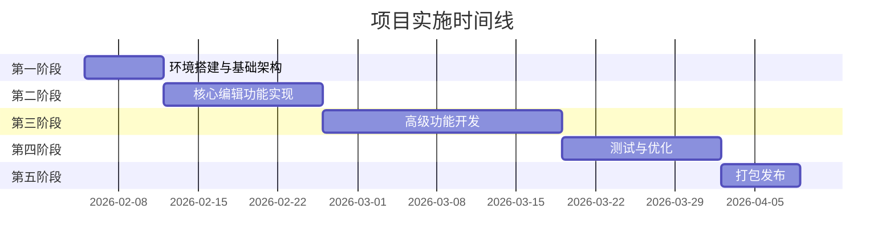

# 游戏本地化编辑工具 - 实施计划

> 本文档规划项目的实施路线图，包括开发阶段、任务分解、优先级排序和里程碑定义。

**版本**: v1.0  
**创建日期**: 2026-02-04  
**预计完成**: 2026-04-30

---

## 项目目标

开发一款**高性能、易用的游戏本地化 CSV 编辑工具**，支持：
- 流畅处理 50000+ 条目
- Excel 式编辑体验
- Unity TextMeshPro 富文本支持
- 全局 Key 值管理
- 强大的搜索替换功能

---

## 开发阶段

### 阶段划分



---

## 第一阶段：环境搭建与基础架构

**时间**: 2026-02-05 ~ 2026-02-11（7 天）  
**目标**: 完成项目初始化和基础架构搭建

### 任务清单

#### 1.1 项目初始化
- [ ] 创建项目目录结构
- [ ] 初始化 Electron + Vite + React 项目
- [ ] 配置 TypeScript
- [ ] 配置 ESLint + Prettier
- [ ] 配置 Git 仓库和 `.gitignore`

**命令**:
```bash
npm create vite@latest . -- --template react-ts
npm install electron electron-builder -D
npm install @electron/vite -D
```

#### 1.2 依赖安装
- [ ] 安装核心依赖
  ```bash
  npm install react react-dom
  npm install zustand immer
  npm install papaparse chardet iconv-lite
  npm install chokidar
  npm install @codemirror/state @codemirror/view @codemirror/language
  npm install react-window
  ```
- [ ] 安装类型定义
  ```bash
  npm install -D @types/react @types/react-dom
  npm install -D @types/papaparse
  ```

#### 1.3 Electron 主进程搭建
- [ ] 创建 `electron/main.ts` 主进程入口
- [ ] 创建 `electron/preload.ts` 预加载脚本
- [ ] 配置 IPC 通信基础架构
- [ ] 实现窗口管理

#### 1.4 基础 UI 框架
- [ ] 创建三列布局组件
- [ ] 实现响应式布局（可拖动调整列宽）
- [ ] 设置全局样式和主题

**验收标准**:
- ✅ 项目可以启动并显示基础界面
- ✅ Electron 主进程和渲染进程通信正常
- ✅ 三列布局显示正确

**预计工时**: 3-4 天

---

## 第二阶段：核心编辑功能实现

**时间**: 2026-02-12 ~ 2026-02-25（14 天）  
**目标**: 实现文件管理、表格编辑、基础验证功能

### 任务清单

#### 2.1 文件管理模块

##### 2.1.1 项目加载
- [ ] 实现文件夹选择对话框（IPC）
- [ ] 扫描并筛选 CSV 文件
- [ ] 自动检测文件编码（使用 `chardet`）
- [ ] 显示文件列表

##### 2.1.2 CSV 解析
- [ ] 集成 `papaparse` 解析器
- [ ] 处理 RFC 4180 标准（引号、换行符、逗号）
- [ ] 提取表头和数据行
- [ ] 缓存第一列为 Key 值

##### 2.1.3 文件保存
- [x] 实现保存功能（IPC）
- [x] 使用原编码格式保存（`iconv-lite`）
- [x] 更新文件状态（移除 `*` 标记）
- [x] 原生菜单集成（File → Save All, Ctrl+S）
- [x] 自动保存实现（30s 周期）

##### 2.1.4 文件列表 UI
- [x] 显示文件名和状态
- [x] 点击文件切换显示
- [x] 移除底部“打开项目”按钮（改为原生菜单）
- [ ] 实现右键菜单
- [ ] 忽略/还原文件功能

**验收标准**:
- ✅ 可以打开文件夹并加载 CSV 文件列表
- ✅ 点击文件可以查看内容
- ✅ 保存后文件编码正确，无乱码

**预计工时**: 4-5 天

---

#### 2.2 表格编辑模块

##### 2.2.1 虚拟滚动表格
- [ ] 集成 `react-window` 的 `FixedSizeGrid`
- [ ] 实现单元格渲染组件
- [ ] 优化性能（`React.memo`）
- [ ] 测试 50000 行数据渲染性能

##### 2.2.2 单元格编辑
- [ ] 双击进入编辑模式
- [ ] 实现受控输入组件
- [ ] `Enter` 键确认并跳转下一行
- [ ] `Tab` 键移动到右侧单元格
- [ ] `Esc` 键取消编辑

##### 2.2.3 键盘导航
- [ ] 方向键移动聚焦单元格
- [ ] 支持多选（`Shift + 方向键`）
- [ ] 框选支持（`鼠标拖拽`）

##### 2.2.4 复制粘贴
- [ ] 复制选中单元格（`Ctrl/Cmd + C`）
- [ ] 粘贴到目标位置（`Ctrl/Cmd + V`）
- [ ] 支持跨行粘贴（Tab 分隔）

**验收标准**:
- ✅ 表格渲染流畅，滚动帧率 > 60 FPS
- ✅ 编辑操作响应时间 < 100ms
- ✅ 复制粘贴功能正常

**预计工时**: 5-6 天

---

#### 2.3 Key 值验证模块

##### 2.3.1 格式验证
- [ ] 实现正则表达式验证（`^[A-Z0-9_]+$`）
- [ ] 非法 Key 单元格标红
- [ ] 实时验证（防抖 500ms）

##### 2.3.2 唯一性检查
- [ ] 全局 Key 值索引
- [ ] 检测跨文件重复
- [ ] 重复 Key 单元格标红

##### 2.3.3 验证结果面板
- [ ] 在第三列显示验证错误列表
- [ ] 显示错误原因（格式 / 重复）
- [ ] 点击跳转到对应位置

**验收标准**:
- ✅ 非法 Key 自动标红
- ✅ 重复 Key 正确检测
- ✅ 验证性能良好（< 1 秒）

**预计工时**: 3-4 天

---

## 第三阶段：高级功能开发

**时间**: 2026-02-26 ~ 2026-03-18（21 天）  
**目标**: 实现富文本编辑、搜索替换、填充柄、文件监控等高级功能

### 任务清单

#### 3.1 富文本编辑器（CodeMirror 6）

##### 3.1.1 基础集成
- [ ] 创建 CodeMirror 6 编辑器组件
- [ ] 配置基础扩展（`basicSetup`）
- [ ] 双向绑定单元格内容

##### 3.1.2 TMP 标签解析
- [ ] 编写标签正则表达式（`<color>`, `<size>`, `<b>`, `<i>`）
- [ ] 实现标签解析器
- [ ] 处理嵌套标签

##### 3.1.3 装饰器实现
- [ ] 创建 `ViewPlugin` 装饰器
- [ ] 实现光标检测逻辑
- [ ] 光标在内：显示源码 + 语法高亮
- [ ] 光标离开：隐藏标签，应用样式

##### 3.1.4 辅助功能
- [ ] 自动补全（输入 `<col` 提示 `<color=>`）
- [ ] 语法验证（标签闭合检查）
- [ ] 快捷键（`Ctrl+B` 包裹粗体）

**验收标准**:
- ✅ 实现 Typora 式编辑体验
- ✅ 支持常用 TMP 标签
- ✅ 性能流畅，无卡顿

**预计工时**: 6-7 天

---

#### 3.2 搜索与替换

##### 3.2.1 搜索引擎
- [ ] 实现普通文本搜索
- [ ] 实现正则表达式搜索
- [ ] 全局搜索 vs 单文件搜索
- [ ] 使用 Web Worker 优化性能

##### 3.2.2 搜索结果
- [ ] 显示结果列表（Key 值、上下文、文件名）
- [ ] 关键词高亮
- [ ] 点击跳转到对应位置

##### 3.2.3 替换功能
- [ ] 单个替换（逐个确认）
- [ ] 全部替换
- [ ] 正则表达式捕获组替换（`$1`, `$2`）

**验收标准**:
- ✅ 搜索 50000 行 < 1 秒
- ✅ 正则表达式功能正常
- ✅ 替换操作可撤销

**预计工时**: 5-6 天

---

#### 3.3 填充柄功能

##### 3.3.1 UI 实现
- [ ] 单元格右下角显示填充柄
- [ ] 鼠标悬停时高亮
- [ ] 拖动时显示范围预览

##### 3.3.2 填充逻辑
- [ ] 检测填充模式（纯复制 / 递增序列）
- [ ] 数字递增（1, 2, 3...）
- [ ] 字符串递增（Item_1, Item_2...）
- [ ] 支持向上/向下填充

**验收标准**:
- ✅ 填充柄交互流畅
- ✅ 递增逻辑正确
- ✅ 操作可撤销

**预计工时**: 3-4 天

---

#### 3.4 文件监控与冲突解决

##### 3.4.1 文件监控
- [ ] 使用 `chokidar` 监控项目文件夹
- [ ] 检测文件变更事件
- [ ] 保存时暂停监控（避免误报）

##### 3.4.2 冲突处理
- [ ] 检测到变更时弹出对话框
- [ ] 提供选项：重新加载 / 保留本地 / 合并
- [ ] 实现简单的自动合并（基于行）
- [ ] 手动冲突解决 UI

**验收标准**:
- ✅ 实时检测外部变更
- ✅ 冲突处理用户体验良好
- ✅ 不丢失数据

**预计工时**: 4-5 天

---

#### 3.5 Undo/Redo 系统

##### 3.5.1 历史栈实现
- [ ] 使用 `immer` 实现不可变状态
- [ ] 创建历史栈 Store（past / present / future）
- [ ] 限制历史栈大小（100 条）

##### 3.5.2 操作记录
- [ ] 单元格编辑
- [ ] 批量粘贴
- [ ] 批量删除
- [ ] 填充柄操作

##### 3.5.3 快捷键
- [ ] `Ctrl/Cmd + Z` 撤销
- [ ] `Ctrl/Cmd + Shift + Z` 重做

**验收标准**:
- ✅ 所有编辑操作可撤销
- ✅ 性能良好，无内存泄漏

**预计工时**: 3-4 天

---

## 第四阶段：测试与优化

**时间**: 2026-03-19 ~ 2026-04-01（14 天）  
**目标**: 全面测试、性能优化、修复 Bug

### 任务清单

#### 4.1 单元测试
- [ ] CSV 解析器测试
- [ ] Key 值验证器测试
- [ ] 搜索引擎测试
- [ ] TMP 标签解析器测试
- [ ] Undo/Redo 逻辑测试

**工具**: Jest + React Testing Library

**目标覆盖率**: > 70%

---

#### 4.2 集成测试
- [ ] 打开项目 → 加载文件
- [ ] 编辑 → 保存 → 验证
- [ ] 搜索 → 替换 → 验证
- [ ] Undo → Redo → 验证
- [ ] 文件监控 → 冲突解决

**工具**: Playwright

---

#### 4.3 性能测试

##### 基准测试
- [ ] 加载 10000 行 CSV
- [ ] 加载 50000 行 CSV
- [ ] 全局搜索 50000 行
- [ ] 单元格编辑响应时间
- [ ] 滚动帧率测试

##### 性能指标
| 指标 | 目标 | 实际 |
|------|------|------|
| 加载 50000 行 | < 2s | TBD |
| 搜索 50000 行 | < 1s | TBD |
| 编辑响应时间 | < 100ms | TBD |
| 滚动帧率 | > 60 FPS | TBD |

---

#### 4.4 性能优化
- [ ] 代码分割（Lazy Loading）
- [ ] 图片/资源优化
- [ ] Web Worker 优化搜索
- [ ] 内存泄漏检测和修复
- [ ] 打包体积优化

---

#### 4.5 Bug 修复
- [ ] 收集测试阶段发现的 Bug
- [ ] 优先级排序
- [ ] 逐个修复并回归测试

**预计工时**: 14 天

---

## 第五阶段：打包发布

**时间**: 2026-04-02 ~ 2026-04-08（7 天）  
**目标**: 打包应用，准备发布

### 任务清单

#### 5.1 Electron Builder 配置
- [ ] 配置 Windows 打包（NSIS）
- [ ] 配置 macOS 打包（DMG）
- [ ] 设置应用图标
- [ ] 配置自动更新（可选）

#### 5.2 安装包测试
- [ ] Windows 安装测试
- [ ] macOS 安装测试
- [ ] 卸载测试
- [ ] 升级测试（可选）

#### 5.3 文档完善
- [ ] 更新 README.md
- [ ] 编写用户手册
- [ ] 编写更新日志（CHANGELOG.md）

#### 5.4 发布
- [ ] 创建 GitHub Release
- [ ] 上传安装包
- [ ] 发布公告

**预计工时**: 7 天

---

## 里程碑定义

### Milestone 1: 基础可用版本
**日期**: 2026-02-25  
**目标**:
- ✅ 可以打开项目并加载 CSV 文件
- ✅ 基础表格编辑功能
- ✅ Key 值验证

---

### Milestone 2: 功能完整版本
**日期**: 2026-03-18  
**目标**:
- ✅ 富文本编辑器
- ✅ 搜索替换
- ✅ 填充柄
- ✅ 文件监控
- ✅ Undo/Redo

---

### Milestone 3: 正式发布版本
**日期**: 2026-04-08  
**目标**:
- ✅ 通过所有测试
- ✅ 性能达标
- ✅ 打包发布

---

## 风险评估

### 高风险项

| 风险 | 影响 | 缓解措施 |
|------|------|----------|
| 性能不达标（50000 行） | 高 | 提前进行性能测试，必要时调整目标 |
| CodeMirror 6 集成复杂 | 中 | 预留充足时间，准备降级方案 |
| 文件冲突解决复杂 | 中 | 先实现简单方案，复杂功能延后 |

### 中风险项

| 风险 | 影响 | 缓解措施 |
|------|------|----------|
| 编码检测不准确 | 中 | 提供手动选择编码的选项 |
| 跨平台兼容性问题 | 中 | 持续在两个平台测试 |

---

## 资源需求

### 人力资源
- **前端开发**: 1-2 人
- **测试**: 1 人（兼职）

### 硬件资源
- Windows 开发机 x1
- macOS 开发机 x1

### 软件资源
- Node.js, Git, VS Code
- Electron, React 等开源库（免费）

---

## 成功标准

项目被认为成功，当：
1. ✅ 所有核心功能实现并通过测试
2. ✅ 性能指标达标
3. ✅ 无严重 Bug（P0/P1）
4. ✅ 用户反馈积极
5. ✅ 按时发布（允许 ±1 周浮动）

---

## 附录

### 开发规范
- 遵循 ESLint Airbnb 规范
- 使用约定式提交（Conventional Commits）
- 代码审查（至少 1 人 Review）

### 分支策略
- `main`: 生产分支
- `develop`: 开发分支
- `feature/*`: 功能分支
- `hotfix/*`: 紧急修复

---

**文档维护者**: 项目负责人  
**最后更新**: 2026-02-04  
**版本**: 1.0
